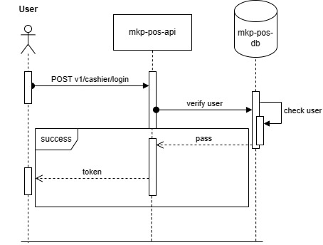
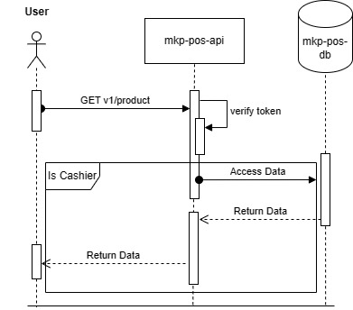
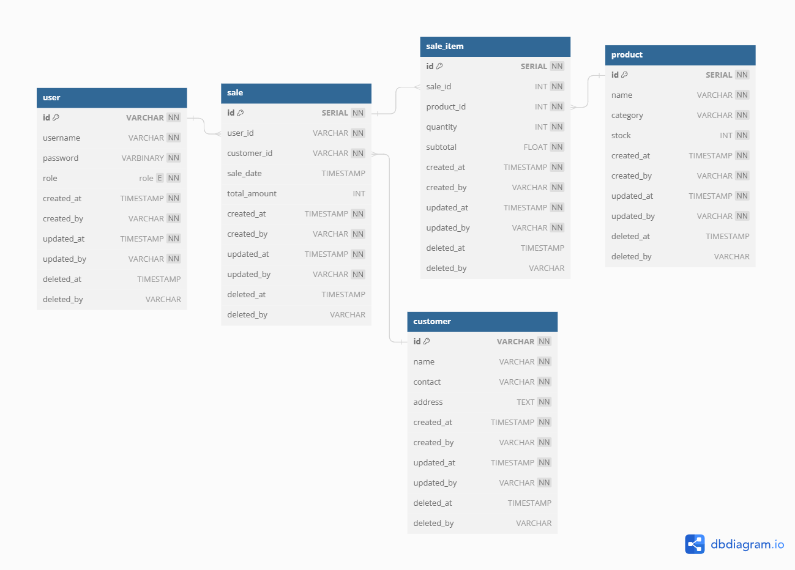

# Name: Muchamad Fauzy

# Mitra Kasih Perkasa POS API

## Description





The provided design outlines the schema for a Point of Sale (POS) Cashier system, which encompasses various entities, such as Users, Products, Customers, and the sales of products. This design provides a clear structure for storing and managing information related to these entities and their interactions.

1. **User Table**:

   - This table represents the system users, such as cashiers and administrators.
   - It includes fields for user ID, username, password (encrypted), role (admin or cashier), and audit information (created_at, created_by, updated_at, updated_by).
   - The 'role' field is a foreign key referencing the 'role' enumeration, which defines the user roles.

2. **Sale Table**:

   - This table records the sales transactions made by customers.
   - It includes fields for sale ID, user ID (the cashier responsible for the sale), customer ID (the customer involved in the sale), sale date, total amount, and audit information.
   - The 'user_id' and 'customer_id' fields are foreign keys, relating to the 'user' and 'customer' tables, respectively.

3. **Customer Table**:

   - This table stores information about customers, including their name, contact information, and address. It also includes audit information.

4. **Sale_Item Table**:

   - This table keeps track of individual items sold within each sale.
   - It includes fields for sale item ID, sale ID (foreign key referencing the 'sale' table), product ID (foreign key referencing the 'product' table), quantity, subtotal, and audit information.

5. **Product Table**:

   - This table represents the available products in the inventory.
   - It includes product ID, name, category, stock quantity, and audit information.
   - The 'stock' field helps to manage and control product availability.

6. **Relationships**:
   - The 'user_id' field in the 'sale' table references the 'id' field in the 'user' table, linking each sale to a specific user or cashier.
   - The 'customer_id' field in the 'sale' table references the 'id' field in the 'customer' table, connecting each sale to a specific customer.
   - The 'sale_id' field in the 'sale_item' table references the 'id' field in the 'sale' table, associating each sale item with a specific sale.
   - The 'product_id' field in the 'sale_item' table references the 'id' field in the 'product' table, indicating which product is being sold.

The design ensures that information about users, customers, products, and sales is structured logically and can be efficiently retrieved and managed. The system allows for tracking sales, managing stock, and providing insights into sales and customer data.

## Setup and Installation

1. Clone the repository and navigate to the root folder

2. Create a `.env` file and set your PostgreSQL DB configurations. Refer to `./infras/postgresql.go` for the required parameters

3. Set up the database tables by running the SQL scripts located in the `./migrations` folder in sequence

4. Generate the necessary wire code:

   ```
   go generate ./...
   ```

5. To start the application, run the following command in the project root folder:

   ```
   go run .
   ```

6. The API will be accessible at [http://localhost:8080](http://localhost:8080)

## Swagger Documentation

To access the API documentation using Swagger, follow these steps:

1. Make sure the server is running locally.
2. Open your web browser and go to [http://localhost:8080/swagger/doc.json/](http://localhost:8080/swagger/doc.json/).
3. You'll see the Swagger UI interface with a list of endpoints, request parameters, and example requests/responses.
4. You can interact with the API directly from the Swagger interface.

## API Endpoints

Once the application is up and running, you can interact with the API using the following endpoints:

### Register Cashier

- **Endpoint:** `POST /v1/cashier/register`
- **Description:** Register an user with cashier role.
- **Request Body Parameters:** `username`, `password`

### Login Cashier

- **Endpoint:** `POST /v1/cashier/login`
- **Description:** Cashier login to access protected endpoints
- **Request Body Parameters:** `username`, `password`

### Read All Product

- **Endpoint:** `GET /v1/products`
- **Description:** View all product
- **Authentication:** Requires authentication and cashier role.
- **Query Parameters:** `page` (default: 1), `size` (default: 10) --> IN PROGRESS

### Insert a New Product

- **Endpoint:** `POST /v1/products`
- **Description:** Insert a new product.
- **Authentication:** Requires authentication and cashier role.
- **Request Body Parameters:** `name`, `category`, and `stock`

## Contributing

Contributions are welcome! If you want to contribute, please follow these steps:

- Create an issue detailing the feature or bug fix you intend to work on.
- Fork the repository and create a new branch for your feature.
- Implement your changes.
- Create a pull request and reference the issue.
